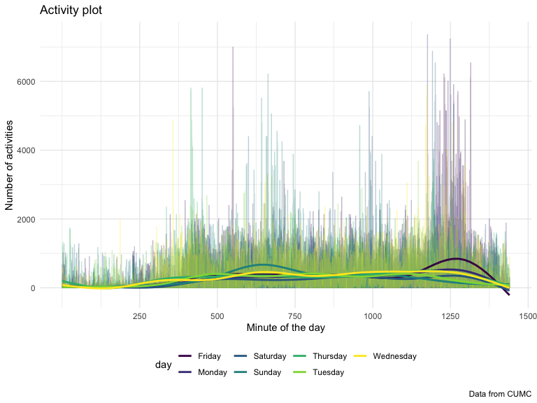

p8105_hw3_mff2137
================
Mohammad Fouda

# Problem 1

## Read in the data from `p8105.datasets`

``` r
data("instacart")

instacart <-
  instacart %>% 
  as_tibble(instacart)
```

## Answers to the questions about the data

This dataset contains 1384617 rows and 15 columns, with each row
resprenting a single product from an instacart order. Variables include
identifiers for the user and the order as well as the order in which
each product was added to the cart and the product name. There are some
order-related variables such as time of the order, and number of days
since prior order. In addition, there are variables about the products
such as name, department (e.g. dairy and eggs, produce), and aisle
(e.g. yogurt, fresh fruits). In total, there are 39123 products found in
131209 orders from 131209 distinct users.

Below is a table summarizing the number of items ordered from aisle. In
total, there are 134 aisles, with fresh vegetables and fresh fruits
holding the most items ordered by far.

``` r
instacart %>% 
  count(aisle) %>% 
  arrange(desc(n))
```

    ## # A tibble: 134 × 2
    ##    aisle                              n
    ##    <chr>                          <int>
    ##  1 fresh vegetables              150609
    ##  2 fresh fruits                  150473
    ##  3 packaged vegetables fruits     78493
    ##  4 yogurt                         55240
    ##  5 packaged cheese                41699
    ##  6 water seltzer sparkling water  36617
    ##  7 milk                           32644
    ##  8 chips pretzels                 31269
    ##  9 soy lactosefree                26240
    ## 10 bread                          23635
    ## # … with 124 more rows

Next is a plot that shows the number of items ordered in each aisle.
Here, aisles are ordered by ascending number of items.

``` r
instacart %>% 
  count(aisle) %>% 
  filter(n > 10000) %>% 
  mutate(aisle = fct_reorder(aisle, n)) %>% 
  ggplot(aes(x = aisle, y = n)) + 
  geom_point() + 
  labs(title = "Number of items ordered in each aisle") +
  theme(axis.text.x = element_text(angle = 60, hjust = 1))
```


Our next table shows the three most popular items in aisles
`baking ingredients`, `dog food care`, and `packaged vegetables fruits`,
and includes the number of times each item is ordered in your table.

``` r
instacart %>% 
  filter(aisle %in% c("baking ingredients", "dog food care", "packaged vegetables fruits")) %>%
  group_by(aisle) %>% 
  count(product_name) %>% 
  mutate(rank = min_rank(desc(n))) %>% 
  filter(rank < 4) %>% 
  arrange(desc(n)) %>%
  knitr::kable()
```

| aisle                      | product_name                                  |    n | rank |
|:---------------------------|:----------------------------------------------|-----:|-----:|
| packaged vegetables fruits | Organic Baby Spinach                          | 9784 |    1 |
| packaged vegetables fruits | Organic Raspberries                           | 5546 |    2 |
| packaged vegetables fruits | Organic Blueberries                           | 4966 |    3 |
| baking ingredients         | Light Brown Sugar                             |  499 |    1 |
| baking ingredients         | Pure Baking Soda                              |  387 |    2 |
| baking ingredients         | Cane Sugar                                    |  336 |    3 |
| dog food care              | Snack Sticks Chicken & Rice Recipe Dog Treats |   30 |    1 |
| dog food care              | Organix Chicken & Brown Rice Recipe           |   28 |    2 |
| dog food care              | Small Dog Biscuits                            |   26 |    3 |

Finally is a table showing the mean hour of the day at which Pink Lady
Apples and Coffee Ice Cream are ordered on each day of the week. This
table has been formatted in an untidy manner for human readers. Pink
Lady Apples are generally purchased slightly earlier in the day than
Coffee Ice Cream, with the exception of day 5.

``` r
instacart %>%
  filter(product_name %in% c("Pink Lady Apples", "Coffee Ice Cream")) %>%
  group_by(product_name, order_dow) %>%
  summarize(mean_hour = mean(order_hour_of_day)) %>%
  pivot_wider(
      names_from = order_dow, 
      values_from = mean_hour) %>%
  knitr::kable(digits = 2)
```

    ## `summarise()` has grouped output by 'product_name'. You can override using the
    ## `.groups` argument.

| product_name     |     0 |     1 |     2 |     3 |     4 |     5 |     6 |
|:-----------------|------:|------:|------:|------:|------:|------:|------:|
| Coffee Ice Cream | 13.77 | 14.32 | 15.38 | 15.32 | 15.22 | 12.26 | 13.83 |
| Pink Lady Apples | 13.44 | 11.36 | 11.70 | 14.25 | 11.55 | 12.78 | 11.94 |

# Problem 2

## Importing and tidying the data

This code chunk imports and cleans the `accel_data` dataset, then switch
it from the wide to the long format to make it easier to manipulate,
then, creates a new variable `weekday_vs_weedend` to identify if the day
the activity is measured falls on a weekend or a weekday.

``` r
accel <-
    read.csv("data/accel_data.csv") %>% 
    janitor::clean_names() %>%
    pivot_longer(
        activity_1:activity_1440,
        names_to = "minute",
        values_to = "n_activities",
        names_prefix = "activity_"
        ) %>% 
    mutate(
        weekday_vs_weekend = if_else(
            day %in% c("Saturday", "Sunday"), "weekend", "weekday"),
        minute= as.integer(minute),
        day = factor(day))
```

## Answering questions about the data

The resulting dataset has 50400 rows and 6 columns. Some of the key
variables include week, day identifier, the minute at which the activity
is measured , and the number of activities at each minute of each day.
There’s also a variable that identifiers if the day on which activities
are measured falls in a weekday vs a weekend.

Below is a code that aggregates across minutes and creates a total
activities per day variable. Results are shown in the table, demonstrate
a higher number of total activities in the last 3 weekdays (Wednesday
through Friday).

``` r
accel %>% 
    group_by(day) %>% 
    summarize(
        total_act = sum(n_activities)) %>% 
    arrange(total_act) %>% 
    knitr::kable()
```

| day       | total_act |
|:----------|----------:|
| Saturday  |   1369237 |
| Tuesday   |   1799238 |
| Monday    |   1858699 |
| Sunday    |   1919213 |
| Thursday  |   2091151 |
| Wednesday |   2129772 |
| Friday    |   2291711 |

Next, making a single-panel plot that shows the 24-hour activity time
courses for each day using color to indicate day of the week.

``` r
accel %>% 
    filter(n_activities < 2500) %>%
    ggplot(aes(x = minute, y = n_activities, color = day)) + 
    geom_point(alpha = .7) +
    geom_smooth(se = FALSE) +
    labs(
    title = "Activity plot",
    x = "Minute of the day",
    y = "Number of activities",
    caption = "Data from CUMC") + 
  scale_x_continuous(
    breaks = c(250, 500, 750, 1000, 1250, 1500))
```

    ## `geom_smooth()` using method = 'gam' and formula 'y ~ s(x, bs = "cs")'



Alternatively, the plot below has the same variables and data but less
crowded which could be more informative.

``` r
accel %>% 
    filter(n_activities < 2500) %>% 
    ggplot(aes(x = minute, y = n_activities, color = day)) + 
    geom_smooth(se = FALSE) +
    labs(
    title = "Activity plot",
    x = "Minute of the day",
    y = "Number of activities",
    caption = "Data from CUMC") + 
  scale_x_continuous(
    breaks = c(250, 500, 750, 1000, 1250, 1500))
```

    ## `geom_smooth()` using method = 'gam' and formula 'y ~ s(x, bs = "cs")'


Based on the plots above shows that the number of activities tend to
markedly increase around minute 250 in across all days then fluctuates
as the day progress while staying just above 200 activities, then a
marked decrease around minute 1300 of the day. While the data shows that
number of activities is higher in certain days (Wednesday, Thursday,
Friday), these patterns aligns with the normal activity cycle expected
along the day(i.e. increase in number during the day and early hours of
the night and very low outside these times).

# Problem 3

## Read in data

``` r
data("ny_noaa")

ny_noaa <-
  ny_noaa %>% 
  as_tibble(ny_noaa)
```

The `ny_noaa` dataset is a dataframe that has 2595176 rows and 7
columns. Some key variables include weather station identifiers, date on
which data was collected, variables showing the amount of precipitation
(tenth of mm), and snow (mm) that fell, snow depth (mm), the maximum and
minimum temperatures (tenth of degree C). Each weather station may
collect only a subset of these variables, the resulting dataset contains
extensive missing data. The number of missing data is 3387623

## Cleaning and tidying the data

In this step, the variables `prcp:tmin` are converted to double for
consistency. Then, the date is separated in to year, month, and day
columns. Then, precipitation unit is changed to millimeter, maximum and
minimum temperature unit is changed to degree C.

``` r
 noaa_tidy <-
   ny_noaa %>%
    separate(date, sep = "-", into = c("year", "month", "day")) %>% 
    mutate(across(.col = (c("year", "month", "day")), as.integer)) %>% 
    mutate(      
        prcp = as.double(prcp),
        snow = as.double(snow),
        snwd = as.double(snwd),
        tmax = as.double(tmax),
        tmin = as.double(tmin),
        month = month.name[month],
        prcp = prcp / 10,
        tmax = tmax / 10,
        tmin = tmin / 10) 
```

## Answering questions

For snowfall, 0 is the most commonly observed value since snowfall does
not occur most days of the year.

``` r
 noaa_tidy %>%
    group_by(snow) %>% 
    count(snow) %>% 
    arrange(desc(n))
```

    ## # A tibble: 282 × 2
    ## # Groups:   snow [282]
    ##     snow       n
    ##    <dbl>   <int>
    ##  1     0 2008508
    ##  2    NA  381221
    ##  3    25   31022
    ##  4    13   23095
    ##  5    51   18274
    ##  6    76   10173
    ##  7     8    9962
    ##  8     5    9748
    ##  9    38    9197
    ## 10     3    8790
    ## # … with 272 more rows

## Average mamximum temperature plot

``` r
 noaa_tidy %>%
    group_by(id, year, month) %>% 
    filter(month %in% c("January", "July")) %>% 
    drop_na() %>% 
    summarize(
        average_tmax = round(mean(tmax), 2)) %>% 
    ggplot(aes(x = year, y = average_tmax, color = id)) +
    geom_line(alpha = .5) +
    facet_grid(. ~ month) +
    theme(legend.position = "none") + 
    labs(
        title = "Average Maximum Temperature plot",
        x = "Year",
        y = "Average Maximum Temperature",
        caption = "Data from rnoaa") + 
    scale_x_continuous(
        breaks = c(1980, 1982, 1984, 1986, 1988, 1990,1992, 1994, 1996, 1998, 2000,
               2002, 2004, 2006, 2008, 2010)) +
    theme(axis.text.x = element_text(angle = 90, vjust = 0.5, hjust=1))
```

    ## `summarise()` has grouped output by 'id', 'year'. You can override using the
    ## `.groups` argument.


The average maximum temperature fluctuated across years but it remained
between -10 and 10 C in January. Some January outliers include years
1982, 1996 (less than -15 C) and 1997, 2006 (approx. 15 C). As for July,
fluctuations were observed across years as well but generally remained
between 20 and 32 C. July outliers include 1984 (just below 20 C), 1988
(below 15 C), 2020 (just below 35 C).
